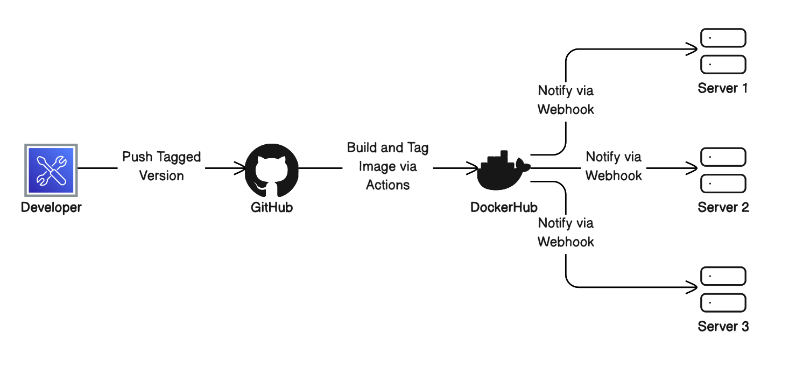

# Project 4
## CI Project Overview
- The goal of this project is to containerize an application, which in this case is going to be a website running on nginx, and to automate pipeline using GitHub actions. This allows us to gain the benefits of portable applications that containers offer. I'll be using DockerHub, Docker Desktop (except not on the desktop but in the terminal), GitHub, and nginx. 

- Developers can push updates to their project (application, website...) to GitHub which will trigger an action that pushes the update to DockerHub and automatically builds and deploys a new container with the updated project.    

## Run Project Locally
- Since I am using MacOS, I actually just installed Docker Desktop from Dockers website, and can now use it in the terminal as long as the application is running in the background.
- To build the image from the Dockerfile, I used `docker build -t nginx_ubuntu:latest .`
- To run the container I used `docker run -it --name project4_nginx -p 80:80 nginx_ubuntu:latest`
- To view the project running in the container I serach http://localhost in the address bar of a browser 

## GitHub Actions and DockerHub
### Prerequisite DockerHub Stuff
- To create a public DockerHub repository, I signed in to DockerHub, went to `Reposiories`, then clicked on `Create repository`. From here, I gave the repository a name and ensured that it was set to Public, then clicked on `Create`.
- To authenticate to DockerHub via the CLI, I used the following command: `docker login -u isabwami`
    - I generated a manual Access Token on DockerHub that I saved to my local system. After running the above command, I used the Access Token when prompted for a password.
- To push my image to DockerHub, I had to first run `docker tag nginx_ubuntu:latest isabwami/sabwami-project4:latest` so that I could create a new tag that points to the same images, but has the exact name it needs (the name of my repository). I then used `docker push isabwami/sabwami-project4:latest` to actually push the image to DockerHub.
- [My DockerHub Repository](https://hub.docker.com/repository/docker/isabwami/sabwami-project4/general) 

### Secrets
- To set up my GitHub repository secrects, I went to `Settings` > `Secrets and variables` > `Actions` then clicked on `New repository secret`. From here, I gave the secret a name then pasted the actual secret in the secret field. 
    - For this project, I have a secret for my DockerHub username and one for my DockerHub password.

### GitHub Workflow
- My GitHub workflow will log in to DockerHub with my credentials that are stored as a repository secret, then build and push my container image with the tag isabwami/sabwami-project4.
    - Since my workflow uses my credentials, which are stored as repository secrets, anyone else using the workflow would need to make sure they have secrets with the same name as is in the workflow (they could either change their secret names in the repo to match the workflow, or in the workflow to match the names)
    - The only other variable would be the container tag that anyone else using this workflow would need to modify to match their DockerHub repository.