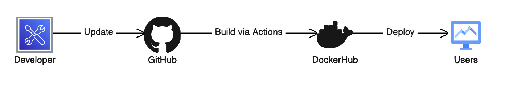
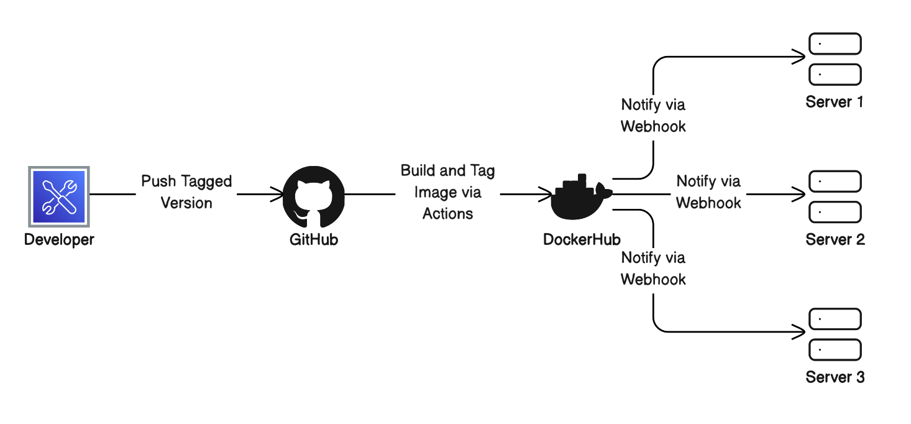

# Project 4
## CI Project Overview
- The goal of this project is to containerize an application, which in this case is going to be a website running on nginx, and to automate pipeline using GitHub actions. This allows us to gain the benefits of portable applications that containers offer. I'll be using DockerHub, Docker Desktop (except not on the desktop but in the terminal), GitHub, and nginx. 

- Developers can push updates to their project (application, website...) to GitHub which will trigger an action that pushes the update to DockerHub and automatically builds and deploys a new container with the updated project.    

## Run Project Locally
- Since I am using MacOS, I actually just installed Docker Desktop from Dockers website, and can now use it in the terminal as long as the application is running in the background.
- To build the image from the Dockerfile, I used `docker build -t nginx_ubuntu:latest .`
- To run the container I used `docker run -it --name project4_nginx -p 80:80 nginx_ubuntu:latest`
- To view the project running in the container I serach http://localhost in the address bar of a browser 

## GitHub Actions and DockerHub
### Prerequisite DockerHub Stuff
- To create a public DockerHub repository, I signed in to DockerHub, went to `Reposiories`, then clicked on `Create repository`. From here, I gave the repository a name and ensured that it was set to Public, then clicked on `Create`.
- To authenticate to DockerHub via the CLI, I used the following command: `docker login -u isabwami`
    - I generated a manual Access Token on DockerHub that I saved to my local system. After running the above command, I used the Access Token when prompted for a password.
- To push my image to DockerHub, I had to first run `docker tag nginx_ubuntu:latest isabwami/sabwami-project4:latest` so that I could create a new tag that points to the same images, but has the exact name it needs (the name of my repository). I then used `docker push isabwami/sabwami-project4:latest` to actually push the image to DockerHub.
- [My DockerHub Repository](https://hub.docker.com/repository/docker/isabwami/sabwami-project4/general) 

### Secrets
- To set up my GitHub repository secrects, I went to `Settings` > `Secrets and variables` > `Actions` then clicked on `New repository secret`. From here, I gave the secret a name then pasted the actual secret in the secret field. 
    - For this project, I have a secret for my DockerHub username and one for my DockerHub password.

### GitHub Workflow
- My GitHub workflow will log in to DockerHub with my credentials that are stored as a repository secret, then build and push my container image with the tag isabwami/sabwami-project4.
    - Since my workflow uses my credentials, which are stored as repository secrets, anyone else using the workflow would need to make sure they have secrets with the same name as is in the workflow (they could either change their secret names in the repo to match the workflow, or in the workflow to match the names)
    - The only other variable would be the container tag that anyone else using this workflow would need to modify to match their DockerHub repository.

# Project 5
## CD Project Overview
- The goal of this project is to apply deployment principles to the contents of project 4. We will be implementing `git tag` metadata to introduce semantic versioning to our website via GitHub Actions, and will then be using webhooks to automatically keep the website's production up to date whenever an update is released (AKA tagged and pushed to GitHub).

- With this automation, developers are only responsible for pushing a tagged version (following semantic versioning standards) to GitHub. Once it's pushed, the GitHub action will build and push a tagged image to DockerHub and DockerHub will notify any listening servers (these servers are likely hosting the content) via webhook, which will trigger a script on each server that will pull the update, stop the current container and start a new container with the new image. 

## Semantic Versioning
- A tag in git can be generated in two ways:
    - Create and push a commit, then run `git tag -a [TAG_NAME] [COMMIT_ID]` to create the tag and `git push origin --tags` to push all tags or `git push origin [TAG_NAME]` to push a specific tag to remote (GitHub)
    - Create a commit, but don't push it yet. Then a tag by using `git tag -a [TAG_NAME]`, which will be a tag of the commit just created. Then push the commit with `git push` then the tag with `git push origin --tags`.
### Workflow
- The updated GitHub workflow will now run when a TAG is pushed to the main branch of the repository. When that happens, it will checkout the repository, collect necessary image/tag metadata, login to docker hub, and build and push the image to dockerhub with the given tag name and label.
- [My DockerHub Repository](https://hub.docker.com/repository/docker/isabwami/sabwami-project4/general) 

## Deployment
- To install docker to my instance there were quite a few steps followed from Docker's documentation. In short, I had to add Docker's official GPG key to my instance, and then I had to add the Docker repository to `apt`'s sources. Once this was done, I was then able to install Docker using `sudo apt-get install docker-ce docker-ce-cli containerd.io docker-buildx-plugin docker-compose-plugin` and then verified it with `sudo docker run hello-world`
### Deployment Script
- Everytime an update is made to the containerized project, it is best to have a script that will stop and remove the old container, pull an updated container image, adn then run the new container. That way, we do not have to do these steps manually each time an update is made.  
- On the instance, the script should be where the `hooks.json` file specifies under `execute-command: "/path/to/script.sh"`. If someone else would like to use the script, they should either move the script to this location, or update the `hooks.json` file to the new location of the script.
### Client-Side Webhook Configuration
- To install adnanh's `webhook`, I chose to use `sudo apt-get install webhook` as it was the path of least resistance.
- To start the `webhook`, I used `webhook -hooks hooks.json -verbose`.
- The `webhook` definition file, `hooks.json` is what tells the webhook what it should do. The `id` field gives the hook a unique identifier, the `execute-command` field specifies what command should be run when the hook is triggered, and `command-working-directory` is used primarily for logging.
- This definition file should be in the directory the webhook is being run from.
- To ensure that the webhook listener is listening as soon as the system is booted, the webhook service file needed to be updated. Specifically, I had to point the service file to the directory in which my definition file was located. I changed the conditional statement to look for the hooks.json file and changed the ExecStart entry to point to the hooks.json file.
- After modifying the webhook service file, I needed to reload the daemon using `systemctl daemon-reload` and then had to restart the webhook service with `sudo systemctl restart webhook.service`.
### Server-Side Webhook Configuration
- To configure the webhook in DockerHub, I went to `Webhooks` under my repository and created a new webhook named `AWS` whos URL is `http://3.226.84.197:9000/hooks/deploy`. The webhook will be triggered only by push events.
- To configure the webhook in GitHub, I would go to my repositor settings and under Webhooks, I would give it the webhook URL and then would specify the `Content type`, `Secret` (if any), and the events that trigger the webhook. 

## Video
[The Culmination of CI/CD Efforts](./Trust-Me-Bro-It-Works.mp4)